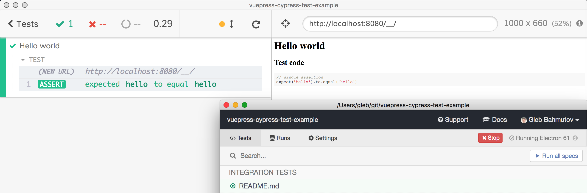
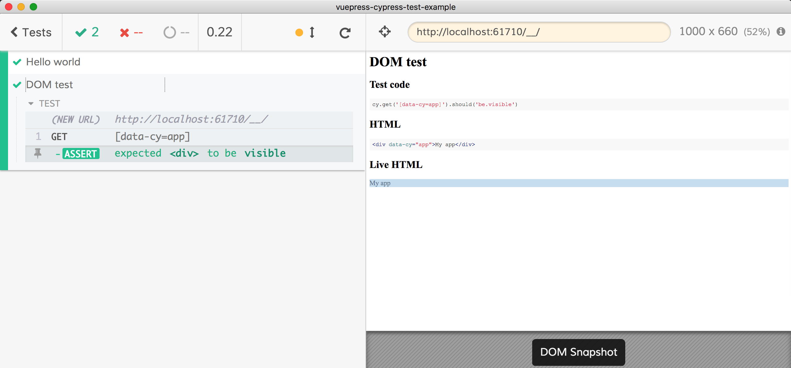

# vuepress-cypress-test-example
> Vuepress static site with Cypress running tests from Markdown files

[Cypress](https://www.cypress.io) Test Runner can run tests extracted from Markdown files using [@cypress/fiddle](https://github.com/cypress-io/cypress-fiddle). [Vuepress](https://vuepress.vuejs.org/) can generate static sites from Markdown documents, just like this README file. Put them together - write Cypress examples in Markdown files, and Cypress will execute them, ensuring that they are correct.

## Examples

### Hello

<!-- fiddle Hello world -->
This is the first test example. It has just JavaScript code.

```js
// single assertion
expect('hello').to.equal('hello')
```
<!-- fiddle-end -->

The actual markdown above is like this:

    <!-- fiddle Hello world -->
    This is the first test example. It has just JavaScript code.

    ```js
    // single assertion
    expect('hello').to.equal('hello')
    ```
    <!-- fiddle-end -->

When you run Cypress you can pick `README.md` as a test and see the above block running.



### DOM

You can add HTML block to act as your site during the test, for example

<!-- fiddle DOM test -->
```html
<div data-cy="app">My app</div>
```
```js
cy.get('[data-cy=app]').should('be.visible')
```
<!-- fiddle-end -->



### Live app

<!-- fiddle Changing DOM example -->
```html
<div id="app">My app</div>
```
```js
// "application" code
const app = document.getElementById('app')
setTimeout(() => {
  app.innerText = 'Changed!'
}, 1000)
// test commands
cy.contains('#app', 'Changed').should('be.visible')
```
<!-- fiddle-end -->

## Site

```shell
npm start
```

Runs Vuepress generator, watches source files, generates live preview at `localhost:8080`.

```shell
npm run build
```

Generates production site in `.vuepress/dist` folder. You can find deployed static site at [https://vuepress-cypress-test-example.netlify.com/](https://vuepress-cypress-test-example.netlify.com/).
